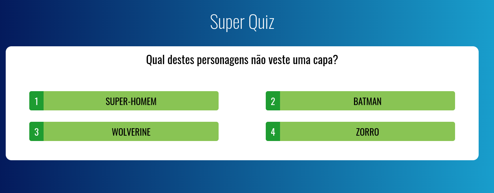

# [VueJs 2 - Udemy course](https://www.udemy.com/share/101Wwu3@jd5FSmHlRDW89XGHV6vpedrRC80K_38RLQ3omv60PAg4NTLS8lEiMxyQbDWjMzU=/)

### Project: Super Quiz

## Project setup
```
yarn install
```

### Compiles and hot-reloads for development
```
yarn serve
```




